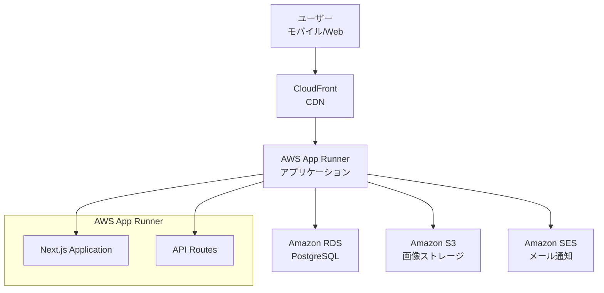
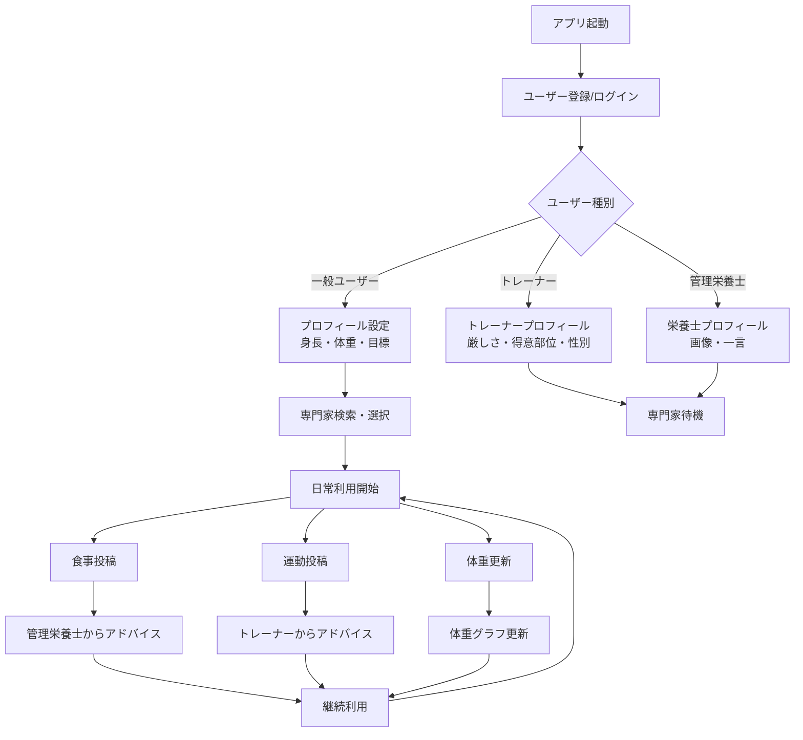

# ダイエット向けフィットネスアプリケーション 要件定義書

## 1. 背景

現代社会において、健康意識の高まりとともにダイエット・フィットネス市場は急速に拡大している。しかし、従来のアプローチは一方向的な情報提供に留まり、個人の状況に応じたパーソナライズされた指導が不足している。

デジタルヘルスケア市場の成長により、ユーザーは単なる記録ツールではなく、専門家との直接的なコミュニケーションと個別指導を求めている。特に、管理栄養士とトレーナーの専門知識を活用した総合的なサポートシステムへのニーズが高まっている。

## 2. 課題

### 2.1 既存サービスの限界
- 一般的なダイエットアプリは記録機能のみで、専門家からの個別アドバイスが得られない
- トレーナーや栄養士との接点が限定的で、継続的なサポートが困難
- ユーザーの好みや性格に合った専門家を見つけることが困難

### 2.2 解決すべき課題
- 専門家とユーザーを効果的にマッチングする仕組みの不在
- リアルタイムでの個別指導とフィードバックの欠如
- 継続的なモチベーション維持の困難さ
- データの可視化による成果実感の不足

## 3. 目的・方針

### 3.1 目的
**「専門家とユーザーをつなぐ、次世代パーソナライズドヘルスプラットフォームの構築」**

ユーザー一人ひとりに最適な管理栄養士とトレーナーをマッチングし、日々の食事と運動に対してリアルタイムで専門的なアドバイスを提供することで、持続可能なダイエット・フィットネス習慣の確立を支援する。

### 3.2 基本方針
- **パーソナライゼーション重視**: ユーザーの好みと専門家の特性を考慮したマッチング
- **専門性の担保**: 管理栄養士とトレーナーによる科学的根拠に基づいたアドバイス
- **継続性の支援**: データ可視化と専門家からの継続的なフィードバックによるモチベーション維持
- **使いやすさの追求**: 直感的なUI/UXによる日常的な利用促進

### 3.3 成功指標（KPI）
- ユーザー継続率（月次・年次）
- 専門家とのマッチング成功率
- ユーザーの目標達成率
- アプリ内でのアドバイス提供頻度
- ユーザー満足度スコア

## 4. 概要（簡単なフロー図）

### 4.1 システム概要
本アプリケーションは、ダイエット・フィットネスを目指すユーザーと専門家（管理栄養士・トレーナー）をマッチングし、日々の食事・運動投稿に対してリアルタイムでアドバイスを提供するプラットフォームです。ユーザーの体重変化をグラフ化し、継続的なモチベーション維持を支援します。

### 4.2 インフラ構成図

### 4.3 主要フロー図

## 5. 機能

### 5.1 認証・ログイン機能
- ユーザー登録・ログイン・ログアウト
- 栄養士登録・ログイン・ログアウト
- トレーナー登録・ログイン・ログアウト

### 5.2 プロフィール管理機能
- ユーザープロフィール（身長、体重入力、目標設定）
- トレーナープロフィール登録（厳しさ、顔画像、得意部位、性別）
- 管理栄養士プロフィール登録（画像、一言）

### 5.3 投稿機能
- 食事投稿機能
- 運動内容の投稿

### 5.4 検索機能
- トレーナー検索（ユーザーが性別、厳しさを元にトレーナーを検索）

### 5.5 アドバイス機能
- 管理者のアドバイス（食事投稿に対して）
- トレーナーのアドバイス（運動内容に対して）

### 5.6 データ可視化機能
- 体重の増減のグラフ化機能（プロフィール更新した日にその体重がデータとして積み上がって、グラフとして表示される）

## 6. 業務フロー
<!-- ユーザー登録フロー、日常利用フロー、アドバイス提供フローなどを記載 -->

## 7. 運用保守（可用性の条件）
<!-- システムの可用性要件、保守運用方針、障害対応などを記載 -->
