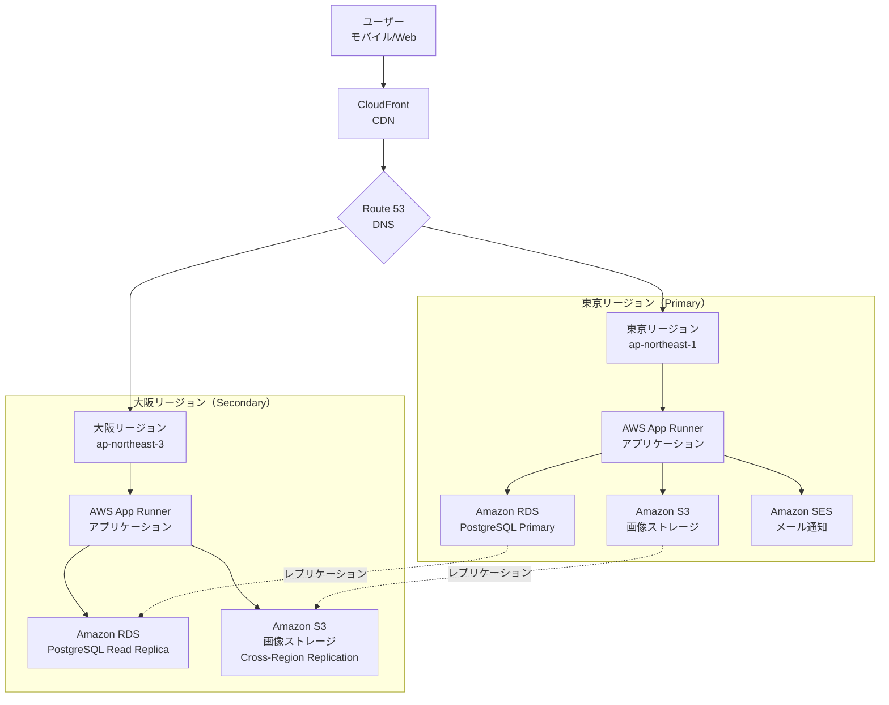
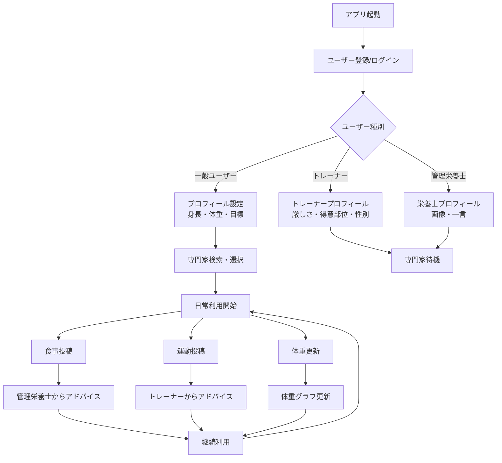
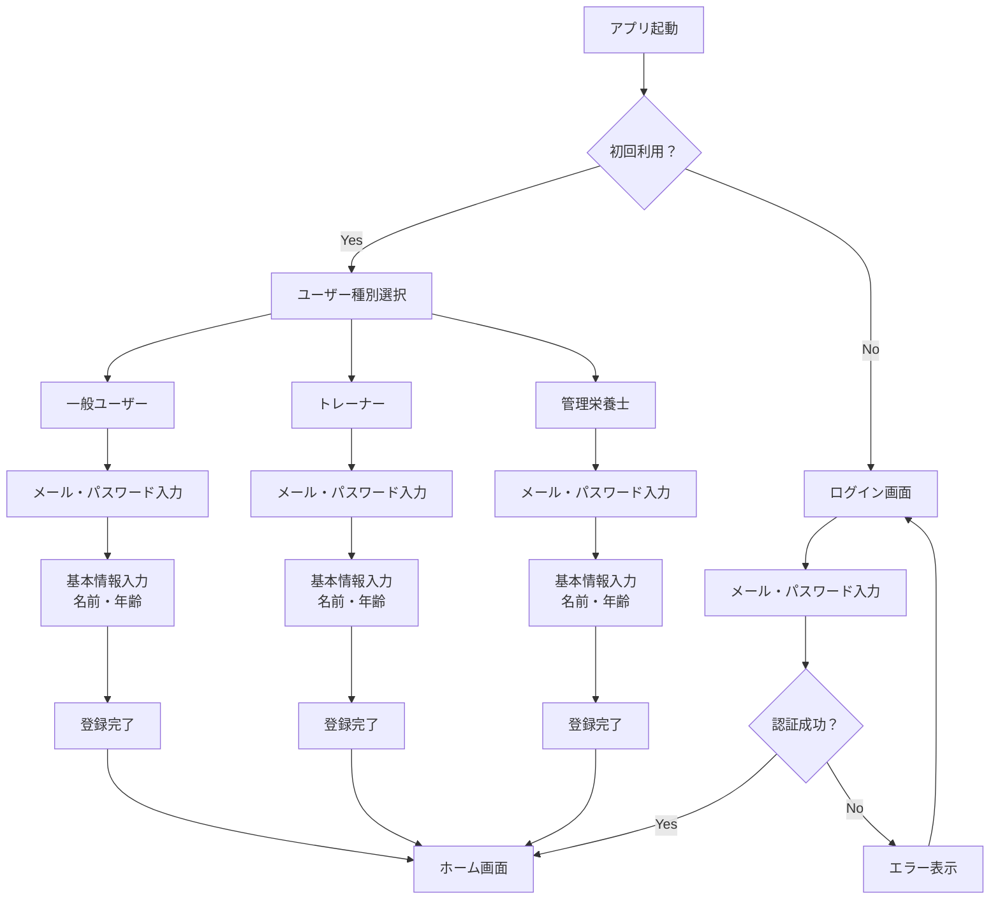
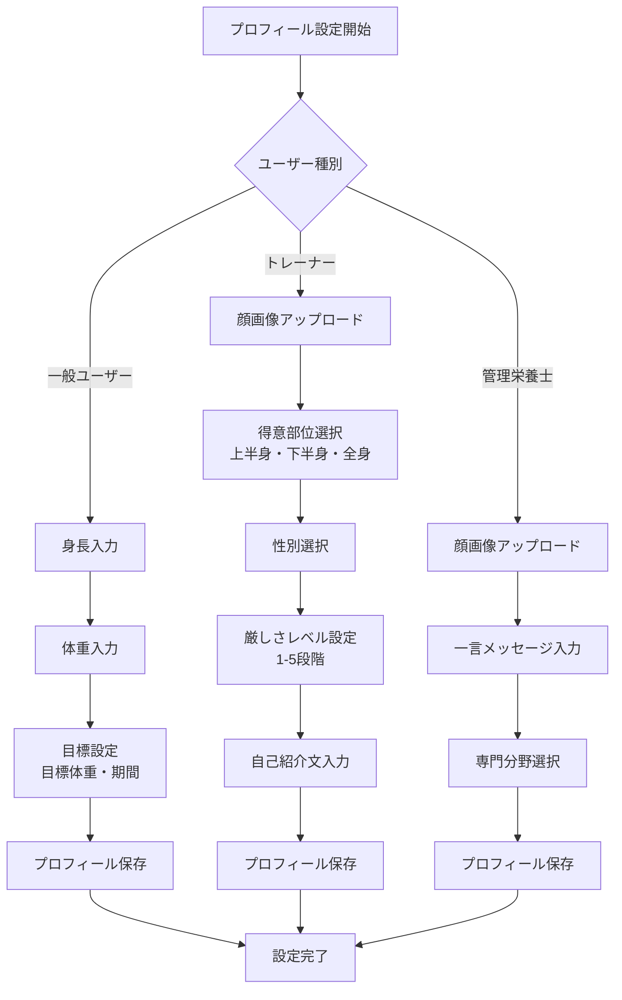
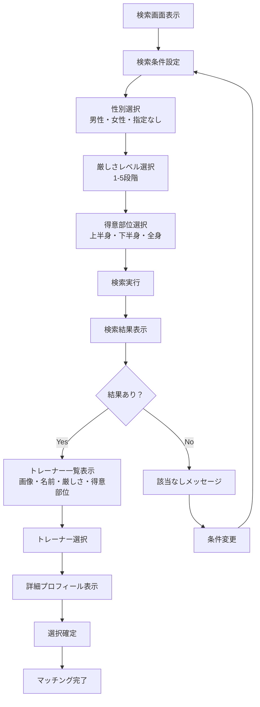
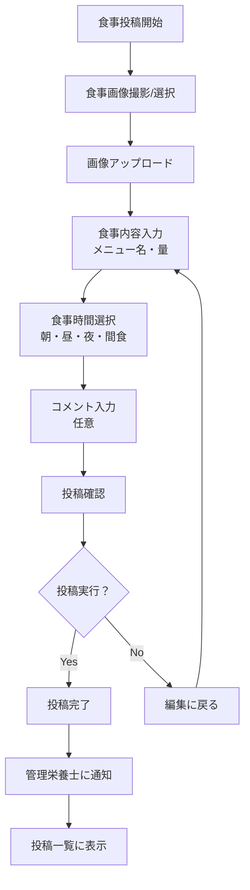
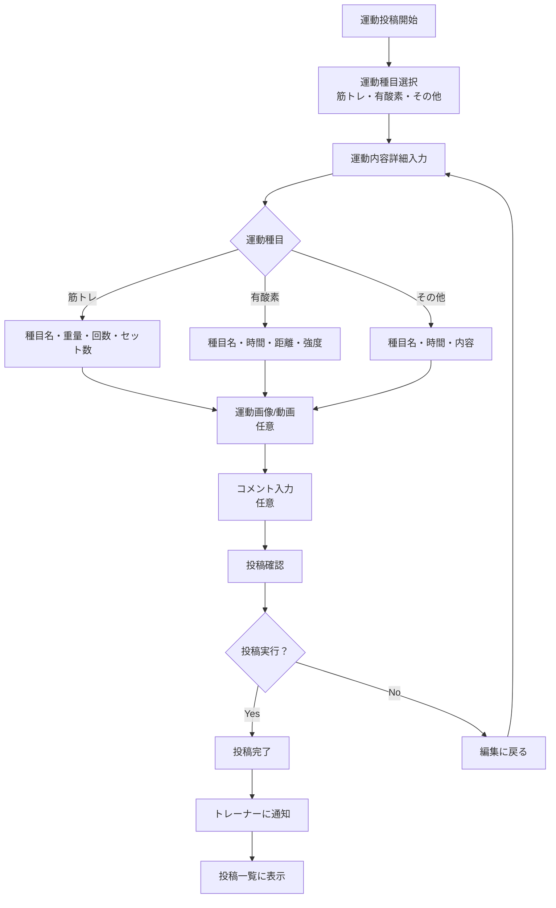
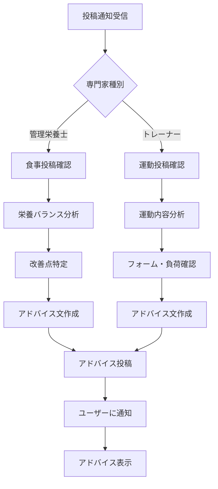
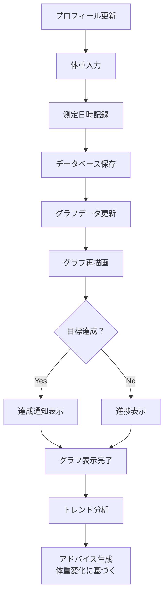
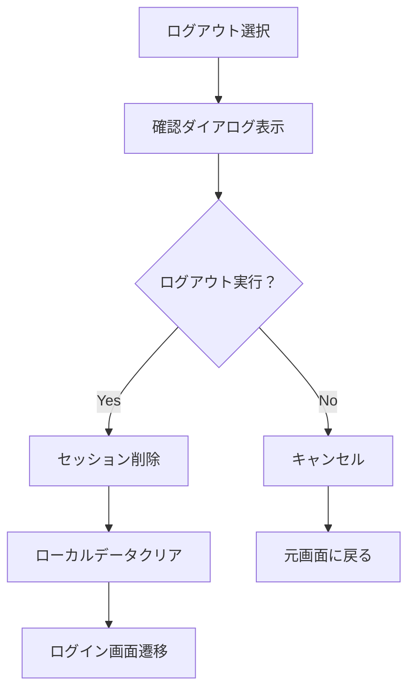

# ダイエット向けフィットネスアプリケーション 要件定義書

## 1. 背景

現代社会において、健康意識の高まりとともにダイエット・フィットネス市場は急速に拡大している。しかし、従来のアプローチは一方向的な情報提供に留まり、個人の状況に応じたパーソナライズされた指導が不足している。

デジタルヘルスケア市場の成長により、ユーザーは単なる記録ツールではなく、専門家との直接的なコミュニケーションと個別指導を求めている。特に、管理栄養士とトレーナーの専門知識を活用した総合的なサポートシステムへのニーズが高まっている。

## 2. 課題

### 2.1 既存サービスの限界
- 一般的なダイエットアプリは記録機能のみで、専門家からの個別アドバイスが得られない
- トレーナーや栄養士との接点が限定的で、継続的なサポートが困難
- ユーザーの好みや性格に合った専門家を見つけることが困難

### 2.2 解決すべき課題
- 専門家とユーザーを効果的にマッチングする仕組みの不在
- リアルタイムでの個別指導とフィードバックの欠如
- 継続的なモチベーション維持の困難さ
- データの可視化による成果実感の不足

## 3. 目的・方針

### 3.1 目的
**「専門家とユーザーをつなぐ、次世代パーソナライズドヘルスプラットフォームの構築」**

ユーザー一人ひとりに最適な管理栄養士とトレーナーをマッチングし、日々の食事と運動に対してリアルタイムで専門的なアドバイスを提供することで、持続可能なダイエット・フィットネス習慣の確立を支援する。

### 3.2 基本方針
- **パーソナライゼーション重視**: ユーザーの好みと専門家の特性を考慮したマッチング
- **専門性の担保**: 管理栄養士とトレーナーによる科学的根拠に基づいたアドバイス
- **継続性の支援**: データ可視化と専門家からの継続的なフィードバックによるモチベーション維持
- **使いやすさの追求**: 直感的なUI/UXによる日常的な利用促進

### 3.3 成功指標（KPI）
- ユーザー継続率（月次・年次）
- 専門家とのマッチング成功率
- ユーザーの目標達成率
- アプリ内でのアドバイス提供頻度
- ユーザー満足度スコア

## 4. 概要（簡単なフロー図）

### 4.1 システム概要
本アプリケーションは、ダイエット・フィットネスを目指すユーザーと専門家（管理栄養士・トレーナー）をマッチングし、日々の食事・運動投稿に対してリアルタイムでアドバイスを提供するプラットフォームです。ユーザーの体重変化をグラフ化し、継続的なモチベーション維持を支援します。

### 4.2 インフラ構成図

### 4.3 主要フロー図

## 5. 機能

### 5.1 認証・ログイン機能
- ユーザー登録・ログイン・ログアウト
- 栄養士登録・ログイン・ログアウト
- トレーナー登録・ログイン・ログアウト

### 5.2 プロフィール管理機能
- ユーザープロフィール（身長、体重入力、目標設定）
- トレーナープロフィール登録（厳しさ、顔画像、得意部位、性別）
- 管理栄養士プロフィール登録（画像、一言）

### 5.3 投稿機能
- 食事投稿機能
- 運動内容の投稿

### 5.4 検索機能
- トレーナー検索（ユーザーが性別、厳しさを元にトレーナーを検索）

### 5.5 アドバイス機能
- 管理者のアドバイス（食事投稿に対して）
- トレーナーのアドバイス（運動内容に対して）

### 5.6 データ可視化機能
- 体重の増減のグラフ化機能（プロフィール更新した日にその体重がデータとして積み上がって、グラフとして表示される）

## 6. 業務フロー

### 6.1 ユーザー登録・ログインフロー

### 6.2 プロフィール設定フロー

### 6.3 トレーナー検索フロー

### 6.4 食事投稿フロー

### 6.5 運動投稿フロー

### 6.6 アドバイス提供フロー

### 6.7 体重グラフ更新フロー

### 6.8 ログアウトフロー

## 7. 運用保守（可用性の条件）

### 7.1 システム稼働時間
- **稼働時間**: 24時間無停止運用
- **計画停止**: 計画停止無し
- **目標可用性**: 99.999%

### 7.2 可用性保証の業務範囲と条件
- **対象業務**: 外部向けオンライン系業務（全機能）
- **復旧時間**: 60秒未満
- **冗長化対応**: 二重障害時でもサービス切替時間の規定内で継続

### 7.3 障害復旧目標（RTO/RPO）
- **復旧時点目標（RPO）**: 障害発生時点（日次バックアップ+アーカイブログからの復旧）
- **復旧時間目標（RTO）**: 2時間以内
- **業務再開範囲**: 全ての業務機能
- **完全復旧期限**: 3日以内

### 7.4 運用保守体制
- **監視体制**: 24時間365日システム監視
- **障害対応**: 即座にエスカレーション体制を発動
- **バックアップ**: 日次自動バックアップ + リアルタイムアーカイブログ
- **災害対策**: 東京・大阪2リージョン構成による冗長化
- **フェイルオーバー**: Route 53ヘルスチェックによる自動切り替え
- **データ同期**: RDSクロスリージョンレプリケーション + S3クロスリージョンレプリケーション
